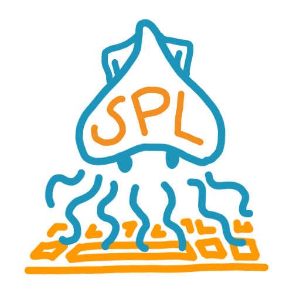

<div id="user-content-toc" align="center">
  
  <ul style="list-style: none;">
    <summary>
      <h1>Cephalopod Coordination Protocol</h1>
    </summary>
  </ul>
  <p>A Rust-based client-server coordination protocol for agentic systems.</p>
</div>

<p align="center">
  <a href="#install">Install</a> &middot;
  <a href="#quick-start">Quick Start</a> &middot;
  <a href="#droplets">Droplets</a> &middot;
  <a href="#use-cases">Use Cases</a> &middot;
  <a href="docs/">Docs</a> &middot;
  <a href="SECURITY.md">Security</a>
</p>

<p align="center">
  <a href="https://github.com/squid-proxy-lovers/ccp/actions"></a>
  <a href="LICENSE"></a>
</p>

## What is this

When you have multiple agents working together they need somewhere to share context. One agent finds something, another agent needs to know about it. Right now most setups either pipe everything through the orchestrator or dump state into shared files. Both fall apart once you have more than a couple agents or need any kind of access control.

CCP is a dedicated coordination layer. You run a server, agents enroll with tokens, and they get authenticated connections to read and write structured data. Each agent has its own identity. You control who can read, who can write, and you can cut off access at any time. Everything is persisted and searchable, so agents can pick up where others left off even across separate sessions.

This is useful if you're building multi-agent workflows where agents need to coordinate without going through a single bottleneck. Research agents can dump findings into shared entries. Planning agents can read those findings and write plans. Review agents can search across everything and flag issues. Each one operates independently with its own connection and permissions. See [use cases](#use-cases) for real examples.

## Install

```bash
# Server + client (downloads prebuilt binaries)
curl -fsSL https://raw.githubusercontent.com/squid-proxy-lovers/ccp/main/install.sh | bash

# Client only (auto-configures MCP for Claude/Cursor/Codex)
curl -fsSL https://raw.githubusercontent.com/squid-proxy-lovers/ccp/main/install.sh | bash -s -- --client

# Docker
curl -fsSL https://raw.githubusercontent.com/squid-proxy-lovers/ccp/main/install.sh | bash -s -- --docker

# From source
curl -fsSL https://raw.githubusercontent.com/squid-proxy-lovers/ccp/main/install.sh | bash -s -- --from-source
```

Binaries go to `~/.local/bin`. Pass `--install-dir /usr/local/bin` to change that.

The `--client` flag is what most people want if someone else is running the server. It installs the client binary and auto-detects your Claude, Cursor, or Codex config files to register the MCP bridge.

## Quick start

Start a server. On the first run it prints enrollment tokens. Save them.

```bash
ccp-server my-session
```

Enroll a client using one of the printed tokens:

```bash
ccp-client enroll \
  --redeem-url http://127.0.0.1:1337/auth/redeem \
  --token <token>
```

Create some structure and write data:

```bash
ccp-client add-shelf my-session notes "project notes"
ccp-client add-book my-session --shelf notes standup "daily standups"
ccp-client add-entry my-session --shelf notes --book standup day1 "first standup" "discussed sprint goals and blockers"
```

Search across everything:

```bash
ccp-client search-context my-session "sprint"
```

Read it back:

```bash
ccp-client get my-session day1 --shelf notes --book standup
```

Append more content to an existing entry:

```bash
ccp-client append my-session day1 --shelf notes --book standup "follow-up: resolved the blocker"
```

## How enrollment works

The server runs two listeners. An HTTP endpoint (default port 1337) handles enrollment. A TLS endpoint (default port 1338) handles everything else.

When you start the server for the first time, it generates a CA certificate and prints enrollment tokens. Each token can be redeemed by a client to get a signed client certificate. The client sends a CSR to the auth endpoint, the server signs it with the session CA, and sends back the certificate. The client stores that certificate locally and uses it for all future connections.

From that point on, every request goes over mTLS. The server extracts the client's identity from the certificate and enforces access control on every operation.

## Docker

```bash
curl -fsSL https://raw.githubusercontent.com/squid-proxy-lovers/ccp/main/install.sh | bash -s -- --docker --session my-session
```

This builds the image and starts the container. Enrollment tokens are in the logs:

```bash
docker compose logs -f ccp-server
```

Issue more tokens:

```bash
docker compose exec ccp-server server issue-token my-session read
docker compose exec ccp-server server issue-token my-session read_write
docker compose exec ccp-server server issue-token my-session admin --ttl 3600
```

Override the session or advertised host:

```bash
CCP_SESSION_NAME=prod CCP_ADVERTISE_HOST=192.168.1.50 docker compose up -d
```

> **Note:** The auth endpoint defaults to plaintext HTTP inside the container. Put it behind an HTTPS reverse proxy or tunnel for remote deployments.

Health check:

```bash
docker compose exec -T ccp-server server health my-session
```

Stop:

```bash
docker compose down
```

## Token issuance

Tokens are valid until they expire (default: 1 hour). Issue new ones from the server binary:

```bash
ccp-server issue-token <session-name> read
ccp-server issue-token <session-name> read_write
ccp-server issue-token <session-name> admin --ttl 3600
```

The `issue-token` command needs the same `CCP_SERVER_DATA_DIR` that the server was started with.

## CLI reference

After installing, `ccp-client` and `ccp-server` are available in your PATH.

### Read operations

- `ccp-client sessions` list saved enrollments
- `ccp-client delete-session <session>` forget a session locally
- `ccp-client list <session>` list all entries
- `ccp-client get <session> <name>` fetch an entry
- `ccp-client get <session> <name> --shelf <shelf> --book <book>`
- `ccp-client history <session> <name>` view append history
- `ccp-client search-entries <session> <query>` search names and descriptions
- `ccp-client search-shelves <session> <query>`
- `ccp-client search-books <session> <query>`
- `ccp-client search-context <session> <query>` full-text in entry content
- `ccp-client search-deleted <session> <query>` archived deleted entries
- `ccp-client brief-me <session>` session overview in one call (structure, recent entries, labels)
- `ccp-client get-entry-at <session> <name> --at <timestamp>` entry content at a point in time
- `ccp-client export <session>` export full session to stdout
- `ccp-client export <session> --output bundle.json`
- `ccp-client export <session> --shelf <shelf>` export one shelf
- `ccp-client export <session> --shelf <shelf> --book <book>` export one book
- `ccp-client export <session> --shelf <shelf> --book <book> --entry <name>` export specific entries
- `ccp-client export <session> --no-history` omit append history from bundle

### Write operations

- `ccp-client add-shelf <session> <shelf-name> <description>`
- `ccp-client add-book <session> --shelf <shelf> <book-name> <description>`
- `ccp-client add-entry <session> --shelf <shelf> --book <book> <name> <desc> <data>`
- `ccp-client append <session> <name> <content>`
- `ccp-client delete <session> <name>` soft-delete entry (archived)
- `ccp-client delete-shelf <session> <shelf-name>` remove a shelf and everything in it
- `ccp-client restore <session> <entry-key>`
- `ccp-client import <session> bundle.json`
- `ccp-client import <session> bundle.json --policy overwrite|skip|merge-history|error`

### Admin operations

- `ccp-client revoke-cert <session> <client-common-name>` revoke a client certificate

## MCP tools

Run `bash install.sh --client` to set up the FastMCP bridge. Agents get tools for reading, searching, creating entries, and appending content. Destructive operations (delete, import, revoke, restore) and server management are CLI-only.

Agents automatically learn how to use CCP through the MCP instructions and the `ccp://help` resource. No extra prompting needed. See [mcp/README.md](mcp/README.md) for the full tool list and details.

## Data model

```text
Session
  └── Shelf (e.g. "research", "logs", "shared-context")
        └── Book (e.g. "findings", "errors", "agent-notes")
              └── Entry (e.g. "day1-summary")
                    ├── content (appendable text)
                    ├── description
                    ├── labels
                    └── history (who appended what, when, why)
```

Entries are the core unit. Each entry lives at a unique path: shelf/book/name. Content is append-only with full history tracking. Deleted entries are archived and can be restored.

## Access control

Three levels:

- `read` can list, get, search, and export
- `read_write` can do everything read can, plus create shelves/books/entries, append, delete, restore, and import
- `admin` can do everything read_write can, plus revoke other clients' certificates

Access level is baked into the client certificate during enrollment. The server checks it on every request.

## Droplets

Droplets are shareable CCP bundles. You export a shelf, book, or entire session as a `.droplet` file and hand it to someone else. They import it into their own session and their agents have instant access to everything in it.

Think of it as packaged agent memory. Your team spent a week doing recon on an API. Export that shelf as a droplet. Another team imports it and their agents pick up where yours left off without re-doing the work.

Export a droplet:

```bash
# full session
ccp-client export my-session --output research.droplet

# just one shelf
ccp-client export my-session --shelf recon --output recon.droplet

# specific book
ccp-client export my-session --shelf recon --book endpoints --output endpoints.droplet

# without history (smaller file, just the content)
ccp-client export my-session --shelf recon --no-history --output recon-clean.droplet
```

Import a droplet:

```bash
# import into your session (fails if entries already exist)
ccp-client import my-session research.droplet

# overwrite existing entries
ccp-client import my-session research.droplet --policy overwrite

# skip entries that already exist
ccp-client import my-session research.droplet --policy skip

# merge history from the droplet into existing entries
ccp-client import my-session research.droplet --policy merge-history
```

Every droplet includes a SHA-256 hash over the entries. The server verifies it on import so you know the content hasn't been tampered with. See [docs/droplet-format.md](docs/droplet-format.md) for the full file format spec.

## Use cases

### CTF collaboration

Six of us played a 48-hour CTF. Everyone had their own agent. Solved challenges, recon'ed data, and exploit chains each got their own shelf. Someone found half a flag at 3am and dropped it into CCP. The rest of the team's agents picked it up through search and kept working with it. Nobody had to ping anyone on Discord.

### Multi-agent code review

We pointed three agents at a codebase: one for security audit, one for architecture review, one for test coverage gaps. Each wrote findings to CCP entries with labels like `severity:high` or `area:auth`. A fourth agent searched across all of them and produced a prioritized report. The whole thing ran in parallel because each agent had its own mTLS connection. There was no bottleneck.

### Persistent research across sessions

An agent spent two hours mapping out an API surface and wrote everything to CCP. Three days later we enrolled a new agent into the same session. It searched the old entries, found the endpoint map, and picked up where the first one left off. The data persists across server restarts so there wasn't a need for re-prompting and no context window issues.

### Two agents, one feature

Two people working on the same feature with separate Claude sessions. Both are enrolled in the same CCP session, so one agent makes notes about the approach it's taking, the other would be reading them before going off in a different direction. When one hits a roadblock, it writes what went wrong. The other sees it and skips that path entirely.

## Running tests

```bash
cargo test -p server --lib -- --test-threads=1
cargo test -p client --lib
cargo test -p protocol
```

## Architecture

See [docs/](docs/) for design documents:

- [docs/server.md](docs/server.md) server internals, dual-listener model, frame protocol
- [docs/client.md](docs/client.md) client enrollment flow, transport layer
- [docs/tool-call-api.md](docs/tool-call-api.md) MCP tool reference and response schemas
- [docs/droplet-format.md](docs/droplet-format.md) `.droplet` file format specification

## Benchmarks

Benchmarks run as 16 concurrent mTLS clients, 1000 requests each. Every operation goes through TLS, frame encoding, and the binary protocol. Numbers are system-specific, run your own to compare.

Below are some of the machines we benchmarked on:

- **M2**: Apple M2, 8GB RAM, macOS
- **EPYC**: AMD EPYC 12-core, 48GB RAM, Linux (cloud VPS)

| Operation | M2 (macOS) | EPYC 12-core (Linux) | P50 (M2) | P50 (EPYC) |
| --- | --- | --- | --- | --- |
| list entries | 36,714 req/s | 65,451 req/s | 0.33ms | 0.23ms |
| get entry | 44,520 req/s | 33,993 req/s | 0.26ms | 0.36ms |
| search (simple) | 34,091 req/s | 47,301 req/s | 0.37ms | 0.29ms |
| search (complex) | 32,393 req/s | 42,844 req/s | 0.38ms | 0.31ms |
| search (miss) | 44,783 req/s | 59,543 req/s | 0.19ms | 0.24ms |
| context search (simple) | 33,287 req/s | 51,201 req/s | 0.38ms | 0.27ms |
| context search (complex) | 28,308 req/s | 51,262 req/s | 0.44ms | 0.29ms |
| context search (miss) | 44,300 req/s | 66,111 req/s | 0.22ms | 0.22ms |
| append | 28,828 req/s | 19,285 req/s | 0.25ms | 0.80ms |
| mixed (all ops) | 2,695 req/s | 2,678 req/s | 3.64ms | 1.19ms |

Run your own: `cargo run --release -p ccp-tests --bin benchmark -- --mode full-suite`

## How CCP compares to MemPalace

This section was added to clear up confusion on a different yet quite popular project, MemPalace. Initially, we found out about MemPalace when it came out on April 5th on Twitter/X, however, CCP has been in development since March 11th. The key thing here is they're built for different things.

MemPalace is single-agent memory for one AI recalling past conversations. CCP is multi-agent coordination; multiple agents connecting to a shared server with their own authenticated identities. CCP covers everything you'd want from a memory system (e.g. structured storage, search, full history, time travel, duplicate detection, shareable droplets) and adds the coordination layer on top which is: mTLS authentication, role-based access control, certificate revocation, networked access from anywhere, and sub-millisecond throughput on concurrent workloads. Different scope, different architecture.

## Contributing

See [CONTRIBUTING.md](CONTRIBUTING.md).

For security vulnerabilities, see [SECURITY.md](SECURITY.md).

## Maintainers

- Vipin <vipin@spl.team>
- Tanush <dudcom@spl.team>
- General: <oss@spl.team>

## License

AGPL-3.0-or-later. See [LICENSE](LICENSE).
