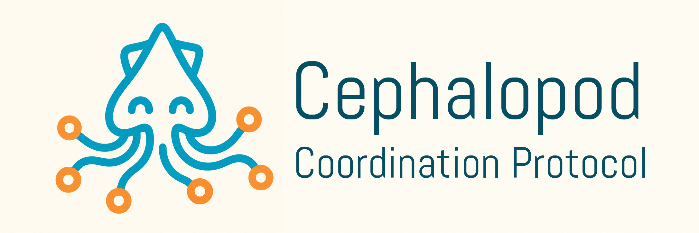

<div id="user-content-toc" align="center">
  
  <p>A Rust-based client-server coordination protocol for agentic systems.</p>
</div>

<p align="center">
  <a href="#install">Install</a> &middot;
  <a href="#quick-start">Quick Start</a> &middot;
  <a href="#droplets">Droplets</a> &middot;
  <a href="#use-cases">Use Cases</a> &middot;
  <a href="docs/">Docs</a> &middot;
  <a href="SECURITY.md">Security</a>
</p>

<p align="center">
  <a href="https://github.com/squid-proxy-lovers/ccp/actions"></a>
  <a href="LICENSE"></a>
</p>

## What CCP does

CCP is shared, persistent context for collaborating agents. A Rust server stores
entries in a `session → shelf → book → entry` hierarchy. Agents use the CLI or
Python MCP bridge to create, append, search, and exchange context.

Normal client traffic uses mTLS with individual client certificates and
server-enforced read, write, or admin permissions. Enrollment uses a separate
HTTP endpoint. SQLite and a journal preserve state across clean restarts.

## Install

```bash
# Server and client
curl -fsSL https://raw.githubusercontent.com/squid-proxy-lovers/ccp/main/install.sh | bash

# Client and MCP bridge for an existing server
curl -fsSL https://raw.githubusercontent.com/squid-proxy-lovers/ccp/main/install.sh | bash -s -- --client

# Docker from the published GHCR image
curl -fsSL https://raw.githubusercontent.com/squid-proxy-lovers/ccp/main/install.sh | bash -s -- --docker --session my-session

# Build from source
curl -fsSL https://raw.githubusercontent.com/squid-proxy-lovers/ccp/main/install.sh | bash -s -- --from-source
```

The default install directory is `~/.local/bin`; override it with `--install-dir`.
The client installer detects supported agent-host configuration for Claude,
Cursor, and Codex. See the [client guide](docs/client.md) for enrollment,
credentials, and configuration.

The Docker installer runs the published GHCR image directly. A failed pull stops
installation and suggests `--docker --from-source`; source builds are explicit.
It retains data in the `ccp-server-data` volume and does not replace an existing
container automatically. Inspect it with `docker logs -f ccp-server`.

For a separate checkout-based Compose deployment:

```bash
docker compose up -d --build
docker compose logs -f ccp-server
```

Configure the session and advertised addresses before deploying remotely. The
[server guide](docs/server.md) explains the two listeners and environment
variables. Protect remote enrollment with HTTPS or a trusted tunnel; normal
protocol traffic uses mTLS.

## Quick start

Start the server and save the enrollment tokens printed on its first run:

```bash
ccp-server my-session
```

Enroll a client with a token that grants write access:

```bash
ccp-client enroll --redeem-url http://127.0.0.1:1337/auth/redeem --token <token>
```

Create an entry, append a finding, and search it:

```bash
ccp-client add-shelf my-session notes "project notes"
ccp-client add-book my-session --shelf notes findings "research findings"
ccp-client add-entry my-session --shelf notes --book findings day1 "first findings" "initial context"
ccp-client append my-session day1 --shelf notes --book findings "follow-up context"
ccp-client search-context my-session "follow-up"
ccp-client get my-session day1 --shelf notes --book findings
```

Entry names are unique within their shelf/book path. Saved enrollments live in
`~/.ccp-client/enrollments/`; `CCP_CLIENT_HOME` overrides that location.

The server operator can issue additional enrollment tokens:

```bash
ccp-server issue-token my-session read
ccp-server issue-token my-session read_write
ccp-server issue-token my-session admin --ttl 3600
```

Use the same server data directory when issuing tokens. Tokens are reusable until
they expire; each redemption issues a distinct client identity.

## Access and MCP

| Access | Operations |
| --- | --- |
| `read` | Read, list, search, history, briefing, and export |
| `read_write` | Read operations plus create, append, delete, restore, and import |
| `admin` | Write operations plus revocation of other client certificates |

The [MCP bridge](mcp/README.md) exposes reading, searching, creation, append,
enrollment, and briefing tools. Its instructions and `ccp://help` resource explain
the workflow. Destructive operations and server lifecycle management remain
CLI-only. See the [tool reference](docs/tool-call-api.md) for arguments and responses.

## Droplets

Droplets are JSON bundles for moving context between CCP sessions:

```bash
ccp-client export my-session --shelf notes --output notes.droplet
ccp-client import another-session notes.droplet
```

Import defaults to failing on conflicts. Choose `overwrite`, `skip`, or
`merge-history` with `--policy`. Export can target a whole session, shelf, book, or
selected entries, and `--no-history` omits append history.

A SHA-256 checksum detects changed or corrupted entry data; it does not authenticate
the sender. See the [droplet format](docs/droplet-format.md) for fields and policies.

## Use cases

- **Shared research:** publish findings once so other agents can retrieve and extend them.
- **Parallel reviews:** collect independently authored findings in scoped books and search them together.
- **Persistent handoffs:** let a later agent resume from stored context and append history.
- **Feature coordination:** share progress and decisions between separate agent-host sessions.

## Development

```bash
python3 -m venv .venv
. .venv/bin/activate
python -m pip install -e ./mcp
make tools
make lint-fast
make test
make integration
```

Rust uses the compiler pinned in `rust-toolchain.toml` and supports a minimum of
1.88. Python 3.10+ is required for the MCP package; use Python 3.13 for the quality
tools. Run `make security` for network-dependent dependency audits.

Read [CONTRIBUTING.md](CONTRIBUTING.md) for setup, quality policy, and PR requirements,
and [tests/README.md](tests/README.md) for integration, MCP, compatibility, and
benchmark commands. The CLI's `--help` output is the command reference.

## Documentation

- [Server](docs/server.md): enrollment, mTLS, deployment, and persistence
- [Client](docs/client.md): local credentials, transport, and CLI selection
- [MCP](mcp/README.md): agent-host setup, tools, and resources
- [Tool-call API](docs/tool-call-api.md): MCP arguments and response shapes
- [Droplet format](docs/droplet-format.md): import/export contracts
- [Tests](tests/README.md): verification suites and benchmark commands
- [Recorded benchmarks](docs/benchmarks.md): historical machine-specific measurements

## Contributing and security

Contributions go through reviewed pull requests. Report vulnerabilities privately
as described in [SECURITY.md](SECURITY.md).

Maintainers: Vipin <vipin@spl.team> and Tanush <dudcom@spl.team>.
General contact: <oss@spl.team>.

## License

AGPL-3.0-or-later. See [LICENSE](LICENSE).
